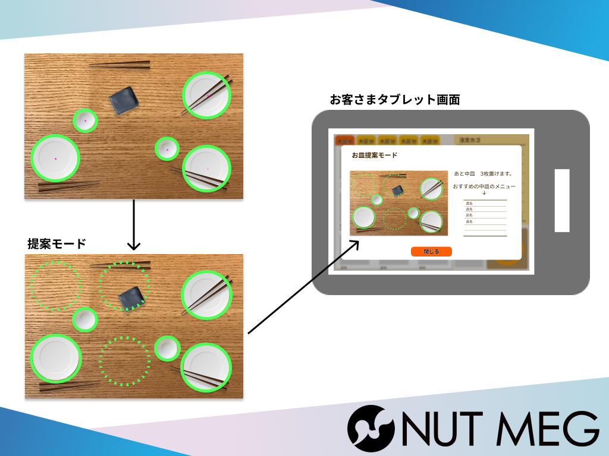
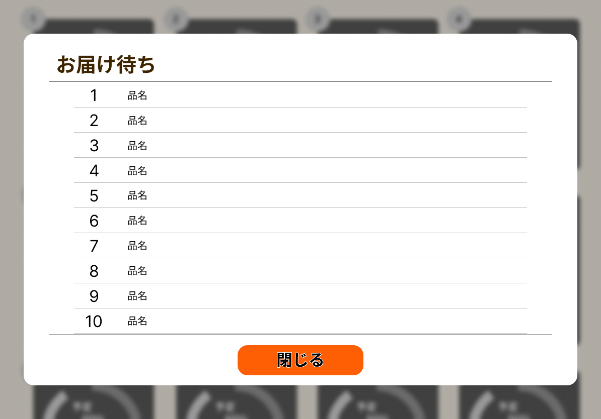
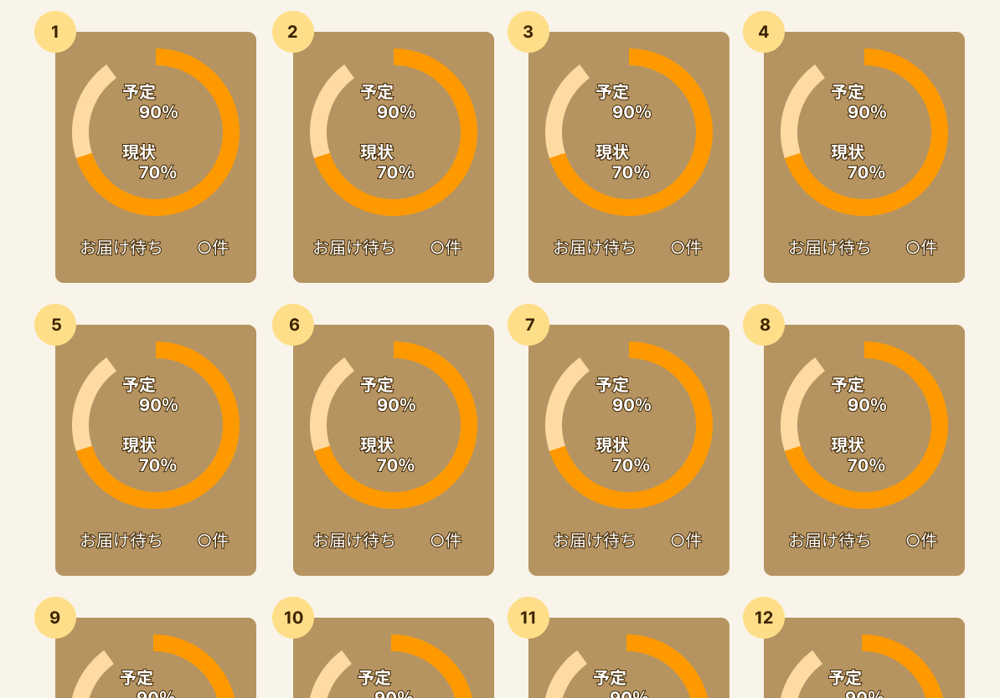
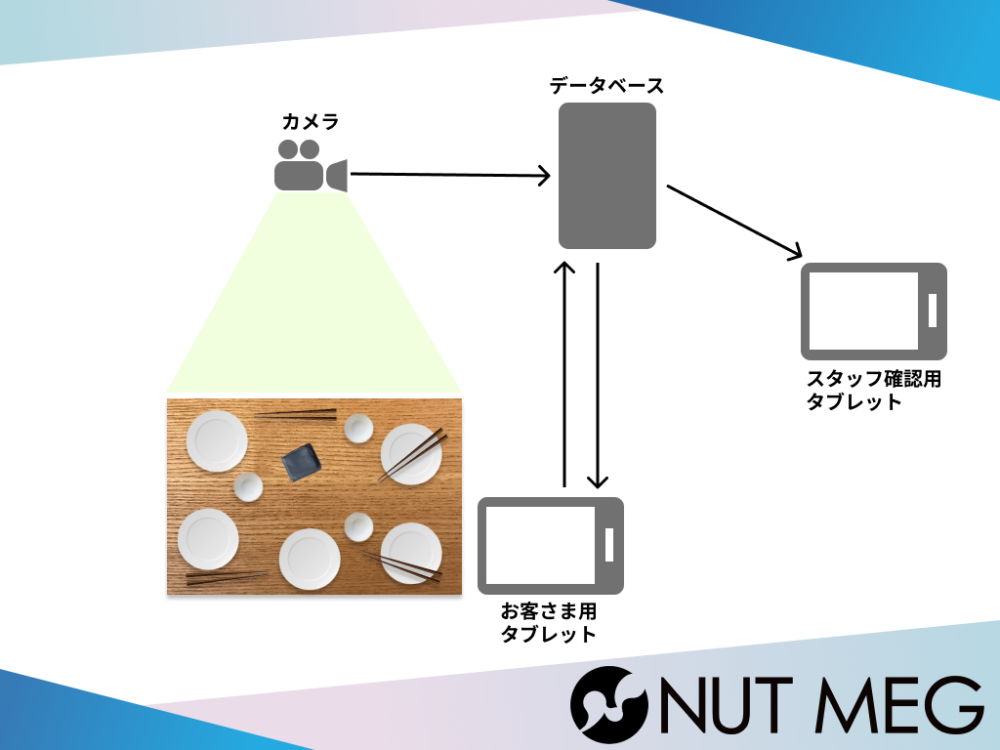

# Dish/Dining

## 製品概要
焼肉屋やなどで机の広範囲を使用する飲食店で、お客さん側の机の使用状況をカメラで把握することで料理の提供を効率化するアプリ

### 背景(製品開発のきっかけ、課題等）
みなさんは、焼肉屋などで料理を頼みすぎて机に乗り切らなかったことはありませんか？
またバイトなどをしたことがある方は、大量に注文されたときにどこまで料理を用意すればいいか困ったことはありませんか？

私達は、飲食店の業務を効率化するためにこのウェブアプリを開発しました！

### 製品説明（具体的な製品の説明）

dish/diningは、机を常時撮影しています。
机はyolov5、お皿はハフ変換を用いることで検出し、検出したデータから机を占めるお皿の占有率を計算します。
計算した占有率をお客さん側、店員側の画面に送ります。

送られたデータは、お客さん向けの画面と店員側の画面の二つで使用されます。

お客さん向けの画面では、注文画面を示します。
注文画面にはメニューの他に現在の机の占有率を示します。

お店側には、現在の机の占有率を示します。

これにより、お客さんの頼みすぎ防止、
店員側は、無駄な配膳を防ぎ、効率化を図ります。

### 特長
#### 1. 特長1

机の使用率を計算するために、机と皿の面積を計算する必要があった。
そこで、私達はyolov5を用いて机を認識し、ハフ変換を用いて皿を検出した。
コントラスト比でなく画像解析を用いたことでより正確に計算することができている。

#### 2. 特長2

お客様向けの注文画面では、メニューのタブ切り替えやモーダルの開閉ができます。
初挑戦のReactを使って作成しました。

#### 3. 特長3

### 解決出来ること
* お客さんの頼みすぎを防ぐことができる

* 店員さんの最適な配膳量を決めることができる 

### 今後の展望

今回私たちは、アイデアの段階で出せた機能のほとんどを実装することができませんでした。そのためできることがまだまだあります。

まず、お客さん向けの画面に注文確認画面をだすことです。
注文確認画面では、注文する料理と注文した料理が現在の机にどのようにおけるかを示します。
これにより、注文後にどれくらいの料理がくるのか視覚的にわかりやすくできると考えました。また、頼みすぎの予防にもなると考えました。

 

また、店側の画面では占有率の他に注文された料理を示したいと考えています。
占有率を用いて、机に置ける料理と置けない料理にわけて、置ける料理から提供できるように表示したいと考えました。

 
 

### 注力したこと（こだわり等）
* 画像解析で、正確な占有率を計算できるようにした。
* 

## 開発技術
### 活用した技術
#### API・データ
* python
* javascript
* css
* html

#### フレームワーク・ライブラリ・モジュール
* react
* fastAPI
* yolov5
* MySQL

#### デバイス

 

### 独自技術
#### ハッカソンで開発した独自機能・技術
* 独自で開発したものの内容をこちらに記載してください
* 特に力を入れた部分をファイルリンク、またはcommit_idを記載してください。

#### 製品に取り入れた研究内容（データ・ソフトウェアなど）（※アカデミック部門の場合のみ提出必須）
* 
* 
